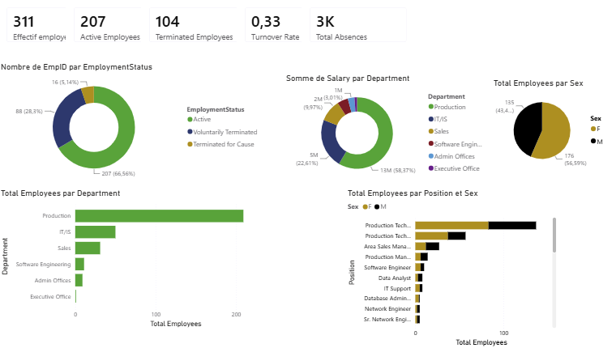
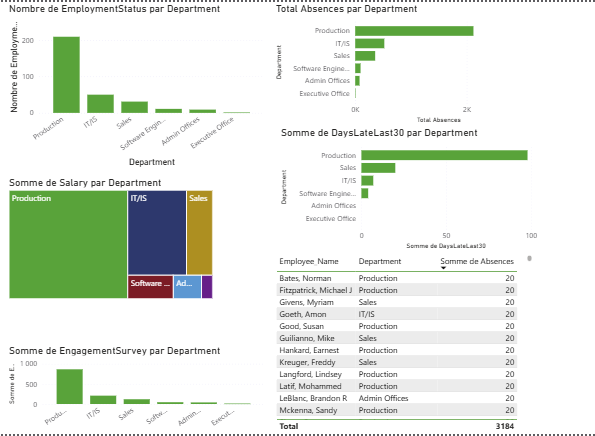
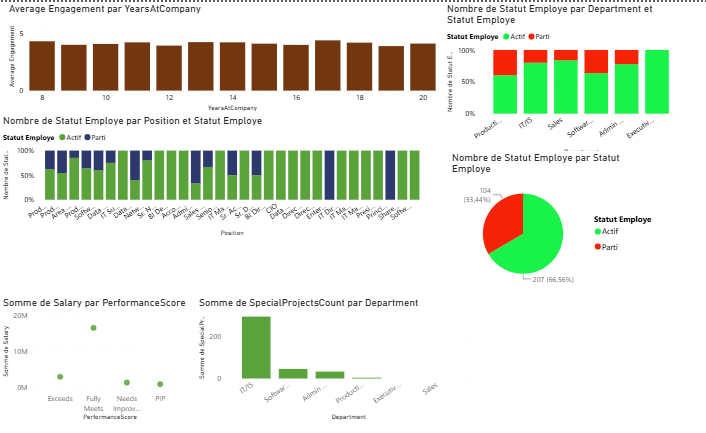
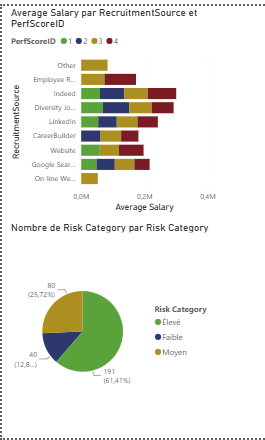

# 📊 Analyse RH avec Power BI

## 📌 Présentation

Dans le cadre de ma quête de montée en compétences en Data Analysis et Business Intelligence, j'ai réalisé un dashboard RH interactif sous Power BI à partir d'un jeu de données disponible sur Kaggle.

L'objectif est d'analyser :

- les effectifs ;
- le turnover ;
- l'absentéisme ;
- l'engagement des collaborateurs ;
- les rémunérations ;
- les indicateurs de risque RH.

---

## 🛠 Outils utilisés

- Power BI
- Power Query
- DAX

---

## 📈 Principaux résultats

- 311 employés analysés
- 207 employés actifs
- 104 départs
- Taux de turnover : 33 %
- 56,6 % de femmes
- Plus de 61 % des employés classés dans une catégorie de risque élevée

---

## 📊 Aperçu des dashboards

### Vue exécutive

### Analyse des départements

### Engagement et performance

### Analyse des risques RH

---

## 📂 Source des données

Jeu de données RH disponible sur Kaggle et utilisé à des fins d'apprentissage et de développement de compétences en Data Analysis et Business Intelligence.

---

## 👨‍💻 Auteur

**Mamadou Pathe DIALLO**

Master 2 Études Économiques et Statistiques

Chargé d'études économiques | Data Scientist | Data Analyst | Business Intelligence | Power BI
